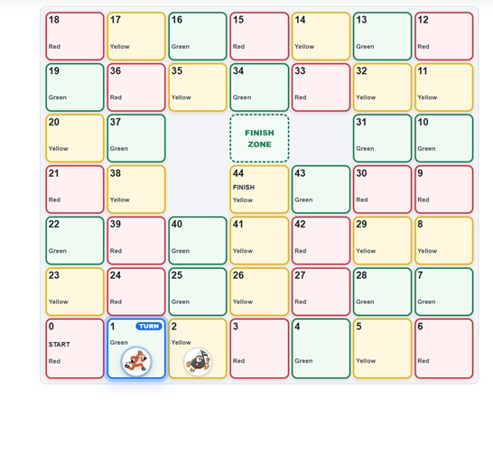
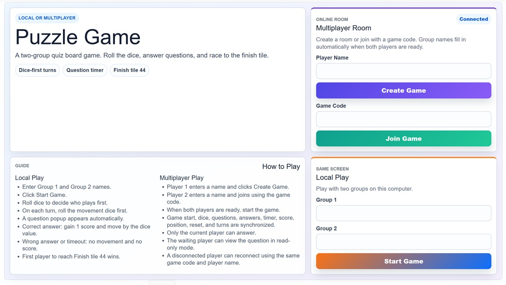
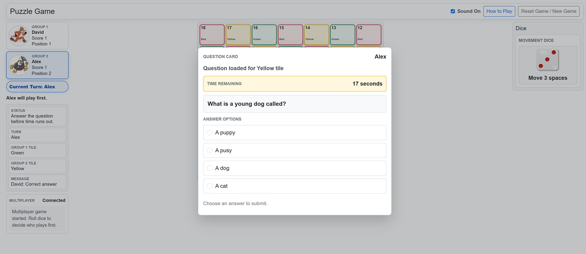
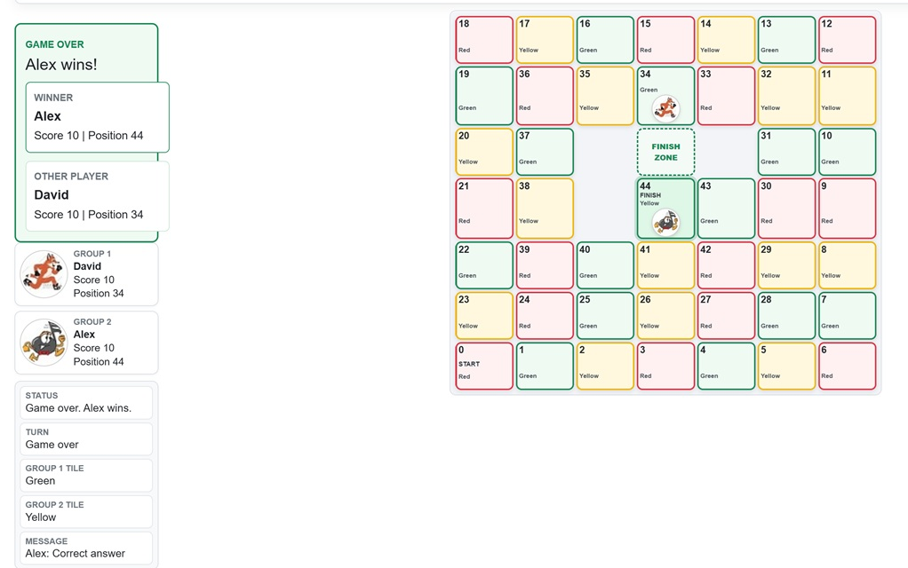

\# Puzzle Board – Real-Time Multiplayer Quiz Game


A full-stack real-time multiplayer quiz board game built with Blazor WebAssembly, ASP.NET Core Web API, and SignalR.


This project is a web-based modernization of an earlier C# Windows Forms game. It supports both local two-player gameplay and online multiplayer rooms.


\## Features


\* Local two-player game mode

\* Online real-time multiplayer mode

\* Create and join rooms using short game codes

\* Real-time synchronization using SignalR

\* Animated dice rolls

\* Step-by-step player movement

\* Question countdown timer

\* Score and turn management

\* Question repetition prevention

\* Player disconnect and reconnect handling

\* Winner detection and synchronized game reset

\* Responsive game board design


\## Technologies


\* C#

\* .NET

\* Blazor WebAssembly

\* ASP.NET Core Web API

\* SignalR

\* HTML

\* CSS

\* JavaScript


\## Project Structure


\* `GameWebApp.Client` – Blazor WebAssembly frontend

\* `GameWebApp.Api` – ASP.NET Core backend, game services, and SignalR hub

\* `GameWebApp.Shared` – Shared models and DTOs


\## Data Storage


The current version manages game rooms and session state in memory. It does not use a database or provide persistent game history.


\## Running the Project


\### 1. Start the API


```bash

cd GameWebApp.Api

dotnet run

```


\### 2. Start the client


Open another terminal:


```bash

cd GameWebApp.Client

dotnet run

```


Open the client URL displayed in the terminal.


\## Multiplayer Testing


1\. Open the application in two browser windows.

2\. Create a multiplayer room in the first window.

3\. Copy the room code.

4\. Join the room from the second window.

5\. Start the game and play from both windows.


\## Future Improvements


\* User authentication

\* Database-backed game sessions

\* Persistent match history

\* Leaderboard

\* Admin interface for question management

\* Automated tests

\* Online deployment


\## Author


Zin Yaw Linn


## Screenshots

### Game Board



### Instructions



### Question Screen



### Winner Screen




